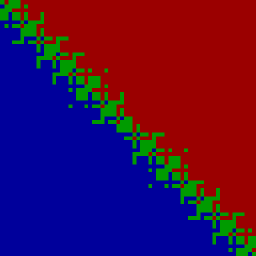

## Why robustness matters
excerpt from [here @mikolalysenko](https://github.com/mikolalysenko/robust-arithmetic-notes/blob/master/README.md)
### Example: Left-right test

One of the most basic tasks in computational geometry is to classify wether a point `r` lies to the left or right of an oriented line defined by a pair of points `p` and `q`:  


Naively, one might attempt to implement such a test using a determinant calculation, or [perp product](http://geomalgorithms.com/vector_products.html#2D-Perp-Product), like this:

```python
def naiveLeftRight(a, b, c):
    abx = c[0] - a[0]
    aby = c[1] - a[1]
    acx = b[0] - a[0]
    acy = b[1] - a[1]
    return abx * acy - aby * acx
```

The sign of this function would determine whether `r` is to the left or the right of the line `pq`. 
In an idealized real RAM machine, this algorithm should give the correct result.  
One way to understand this visually is to fix the points `p` and `q` and vary the point `r`, 
and plot the sign of the query as the color of each pixel. For example, 
we take the points `p` and `q` to be `[12,12]` and `[24,24]` and vary the components of `r` 
over the interval `[0.5,0.5+Math.pow(2,-42)]`, and color the pixels according to the rule:

```
left   ~>  blue
right  ~>  red
on     ~>  green
```

Then we would expect to get an image that looks something like this:


But if the above Python code is actually executed, the output will instead look like this:



In addition to looking absolutely crazy, the following things are wrong with this picture:

1.  Many points are incorrectly classified as being on the line.
2.  Some points near the boundary are incorrectly classified as being to the left or right of the line.
